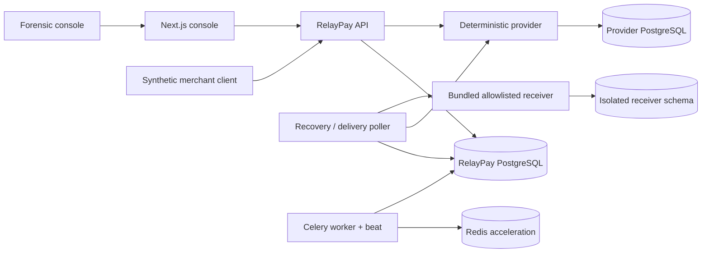

# RelayPay

RelayPay is an evidence-first, INR-only payment-orchestration sandbox. It demonstrates how a
payment service can survive a provider committing a financial effect while its response is lost:
the mutation is never repeated, recovery uses a signed status lookup, and local state finalizes
exactly once with an immutable balanced ledger entry, event, and webhook trail.

**Synthetic data only. RelayPay is not a payment processor and must never receive real card,
bank-account, identity, or customer data.**

## Primary proof

The forensic console runs one deterministic lost-capture-response journey and proves:

- one provider capture effect and one local capture;
- one status-only recovery lookup after the ambiguous response;
- one balanced, immutable capture journal;
- byte-stable terminal responses across both attached capture keys;
- one immutable capture event and one acknowledged webhook delivery.

## Quickstart

Requirements: Docker with Compose, Python 3.12, [uv](https://docs.astral.sh/uv/), and Node.js 24.

```bash
cp .env.example .env
uv sync --frozen
npm ci --prefix apps/console
docker compose up --build
```

Open `http://localhost:3000/login` and use either synthetic administrator:

```text
admin@northstar.test / RelayPay-Northstar-2026!
admin@juniper.test   / RelayPay-Juniper-2026!
```

Select **Run lost-response scenario**, then follow **Inspect payment evidence**. The CLI proof is
also available while the stack is running:

```bash
make demo
```

## Developer gate

```bash
make lint
make typecheck
make test
make console-check
make console-e2e
```

Integration tests use PostgreSQL and Redis at the development ports from `.env.example`. Start
them with `make infra-up`, then run `make migrate` and `make seed` when not using the complete
Compose stack.

To restore only synthetic state, stop application processes and use the explicit destructive
confirmation:

```bash
docker compose stop api provider receiver worker poller console
SANDBOX_RESET_CONFIRM=RESET_SYNTHETIC_RELAYPAY make reset
docker compose up -d
```

The reset leaves schemas and Alembic history intact, truncates only RelayPay/provider/receiver
application data, and reseeds both demo organisations. Production additionally requires
`ALLOW_SANDBOX_RESET=true`.

## System map



Correctness does not depend on Redis: PostgreSQL is the authority for operation state, leases,
ledger history, immutable event bytes, and delivery progress.

## Documentation

- [Architecture](docs/architecture.md)
- [Threat model](docs/threat-model.md)
- [Deployment and backups](docs/deployment.md)
- [Known limitations](docs/limitations.md)
- [Release test evidence](docs/test-evidence.md)
- [Architecture decisions](docs/adr/README.md)
- [PRD, TRD, flows, UI brief, schema, and frozen six-week plan](docs/vibe-coding/README.md)
- [Phase 2 product contract](docs/phase-2/product-contract.md)
- [Phase 2 implementation roadmap](docs/phase-2/implementation-roadmap.md)
- [v0.1.0 release notes](docs/releases/v0.1.0.md)

## Technology

Python 3.12, FastAPI, Pydantic v2, SQLAlchemy 2, Psycopg 3, Alembic, PostgreSQL 17,
Redis/Celery, Next.js 16 App Router, React 19, TypeScript, Playwright, Caddy, and Docker Compose.

RelayPay is available under the [MIT License](LICENSE). Release publication does not deploy or
host the sandbox.
